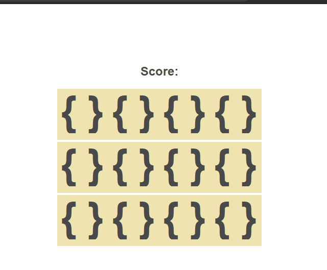

    

<h1 align="center">Memory Game</h1>
<h3 align="center">A based game in vanilla JavaScript, HTML and CSS</h3>

Memory Game, also known as the Concentration card game or Matching Game, is a simple card game where you need to match pairs by turn over 2 cards at a time. There are so many versions of it it is hard to in down it's exact origin.

If you want to learn how to use _setAttritube_ and _getAttribute_ effectively, please have a look at my code.

I have kept the styling at a bare minimum for you to go wild and make it your own. Please tag me as I would LOVE to see your game!!!

### Rules of Memory Game
- You will start by flipping over one card.
- If the next card you flip matches, a pop up alert notifies you and you get +1 to your score.
- These cards then disspear.
- If the next card you flip does not match, the cards flip back, and you can try again.
- The game continues until you match all the cards on the board.

### What inbuilt functions are we going to focus on?
- for loops
- addEventListener
- removeEventListener
- setAttribute
- getAttribute
- data-name
- document.querySelector
- createElement

#### MIT Licence

Copyright (c) 2020 [Ania Kubow](https://github.com/kubowania)
